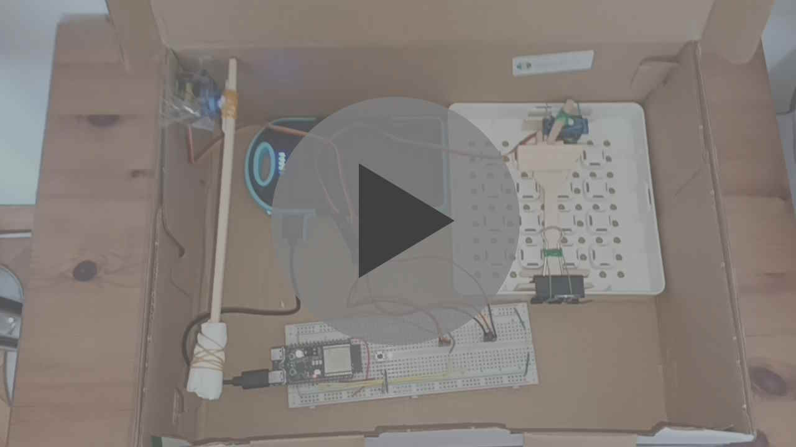

# Hidden catapult
My first project with my ESP32-C6 (DevkitC-1) board. A catapult hidden in a shoebox.

## Operation
1. Load your catapult and make sure that the launch servo can release your projectile.
2. Press the button. The ESP32's light should go from a dim blue (`EMPTY` state), to yellow (`LOADED` state).
3. Close the box
4. Use an app on your phone like `"nRF Connect"` to connect to the BLE device `"Catapult (ESP32)"`. Under the service you will find two characteristics. The one with `READ` indicates the catapult's state: `EMPTY`, `LOADED` or `SHOOTING`.
5. To shoot, write the string `"shoot"` (as UTF-8) to the characteristic with `WRITE` permissions. The LED should turn red, indicating the `SHOOTING` state.
6. Wait for it to go back into the `EMPTY` state, repeat.

## Instructions for assembling yourself

### List of supplies
- breadboard and wires
- two SG90 servos (or others, but these ones are nice)
- 6 jumper cables to connect the servos to the breadboard
- ESP32 board with BLE capabilities
- button (if you dont have one just make it so it can always shoot, or modify to use the builtin `BOOT` button instead)
- Powerbank for power (optional, you can connect it with a cable)

### Schematic

Note that I picked the resistor between the button and ground to be 220Ω arbitrarily. I think that it is fine, but I'm not that good in electronics to say that I am 100% sure.

### Photos and videos
You obviously can't recreate my build exactly 1:1, so just find a way to make the mechanisms for the box and launching yourself, and attach the servos. This is just an example.

### Programming
Since your setup most likely won't be the same as mine, you would need to change the code to calibrate the shooting procedure to the way your exact servos are set up. Make sure to do this before using the catapult.